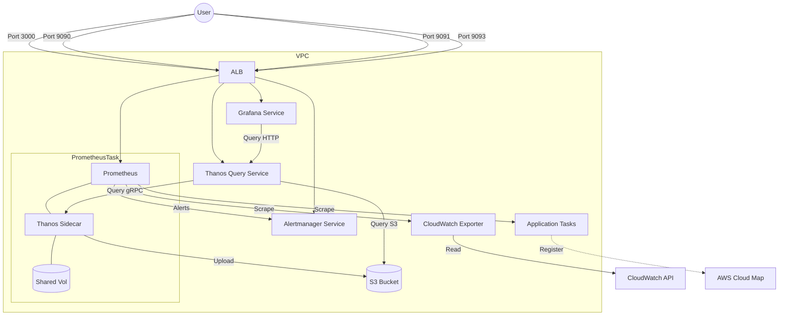

# ECS Watchtower Architecture

## Overview
ECS Watchtower is a production-grade, standalone monitoring infrastructure for AWS ECS Fargate. It provides real-time metrics, alerting, long-term storage, and automated dashboarding.

## Components

### 1. Prometheus + Thanos Sidecar (Core)
- **Prometheus**: Collects metrics from application containers via AWS Cloud Map.
- **Thanos Sidecar**: Ships Prometheus blocks to S3 every 2 hours for long-term retention and provides a gRPC interface for global querying.
- **Shared Volume**: An ECS ephemeral volume shared between Prometheus and Thanos Sidecar to local TSDB data.

### 2. Alertmanager
- **Function**: Processes alerts sent by Prometheus and routes them to notification receivers.
- **Rules**: Pre-configured with ECS-specific alerts (High CPU, Target Down, Task Unreachable).

### 3. CloudWatch Exporter
- **Function**: Bridges the gap between AWS-native metrics and Prometheus.
- **Metrics Collected**: ECS Service CPU/Memory utilization, Cluster metrics, and Task counts.

### 4. Thanos Query
- **Function**: Provides a unified query interface. It aggregates data from the Prometheus Sidecar (real-time) and S3 (historical).
- **Grafana Integration**: Grafana queries Thanos Query instead of Prometheus directly to ensure long-term data visibility.

### 5. Grafana (Visuals)
- **Provisioning**: Dashboards and Datasources are automatically loaded from `/etc/grafana/provisioning/`.
- **Pre-loaded Dashboards**: Includes an "ECS Stack Overview" out of the box.

## Data Flow Diagram

## Security
- **Strict Security Groups**: Only the ALB can talk to application ports.
- **IAM Least Privilege**: Tasks only have permissions to read metrics (CloudWatch) and write/read their own S3 bucket.
- **Private Networking**: All monitoring traffic stays within the VPC private subnets.
